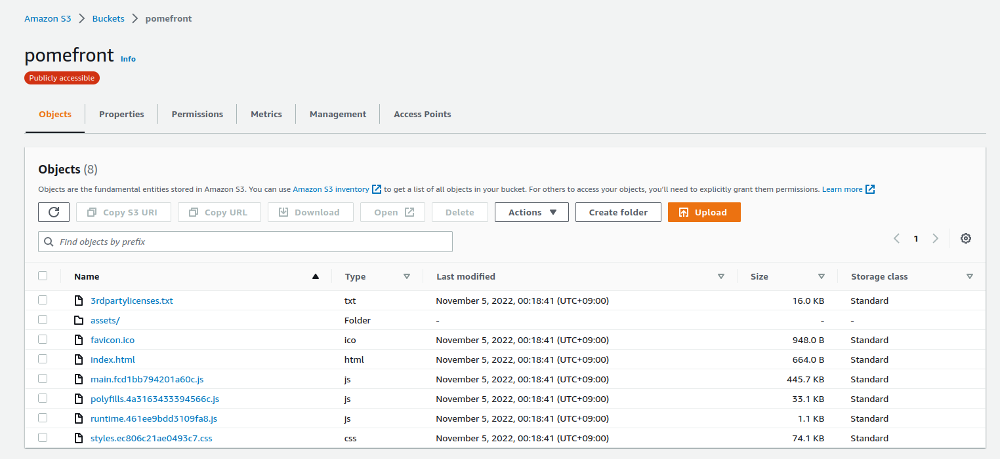
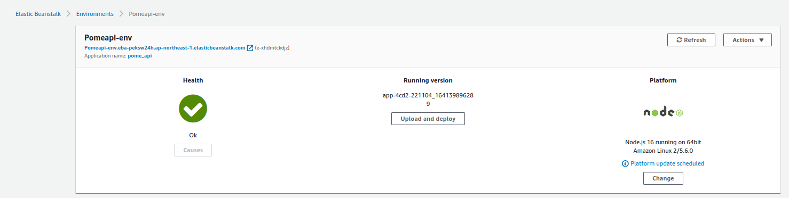
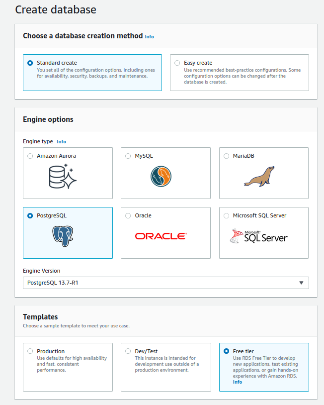
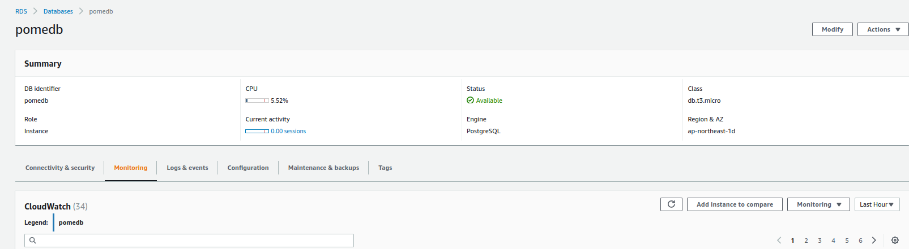

### Development and Deployment Architecture

Folowing is the diagram showing the overview of the pipeline and infrastructure.
From top to buttom in the diagram:
- Visual Studio Code to develop node.js applications.
- GitHub to store and control source code and documents
- CircleCI for automous build, test, and deployment
- AWS managed services to operate the "full stack Web application" in Japan East region (ap-northeast-1)
    -  **AWS S3** to host the frontend Web application implemented with Angular (Angular CLI: 14.2.6, Node: 16.18.0)
    - **AWS Elastic Beanstalk** to run API service with express.js
    - **AWS RDS** to run PostgreSQL DB to store my skills db (Ubuntu 12.12-0ubuntu0.20.04.1), server 13.7, db.t3.micro))
- Users can see the Web page by accessing to the index.html deployed to **AWS S3**

### S3 to host the frontend Web Application

To host the front end application implemented with Angular, S3 is set up to host that application.
Only the distribution packge (after compiled from TypeScrip to JavaScript) is deployed.

#### Elastic Beanstalk

To host the middleware API server to extract skills for the frontend Angular application, Elastic Beanstalk is set up.
The middle ware is impolemented with express.js.

#### RDS

To store skills to discplay in the Web Page, skills database is created in PostgreSQL on AWS.
As this is only for the test purpose, I have selected the free tierer.

