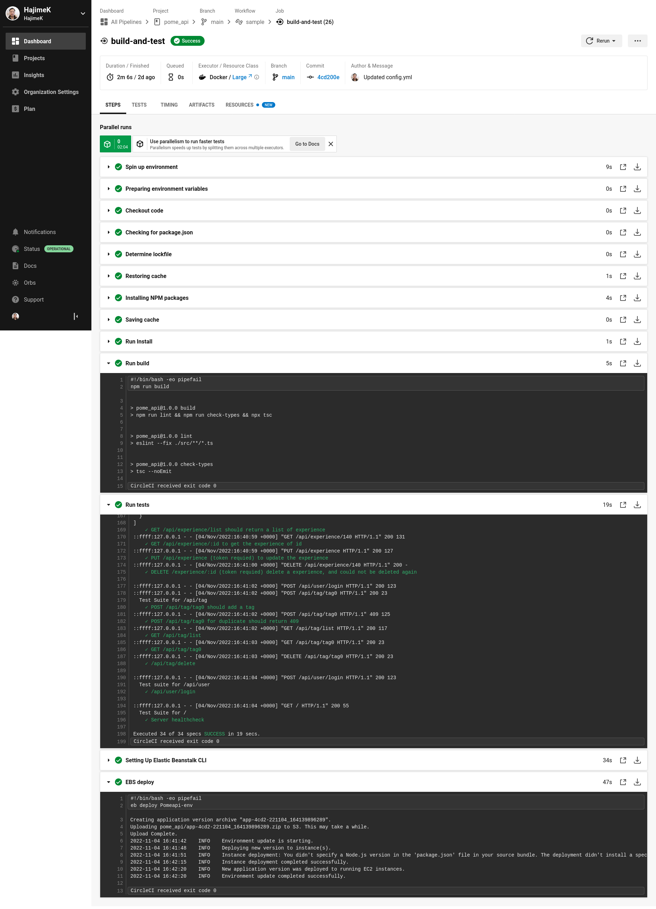

# POME Deployment Pipeline

### Development and Deployment Architecture

Folowing is the diagram showing the overview of the pipeline and infrastructure.

## Front Web Application

### Pipeline steps are defined in the below file.
[Circle CI Build and Deploy steps](https://github.com/HajimeK/pome_front/blob/main/.circleci/config.yml)

### CI/CD with CircleCI Execution Result

https://github.com/HajimeK/pome_front/blob/main/.circleci/config.yml

## Middleware API service

### Pipeline steps are defined in the below file.
[Circle CI Build and Deploy steps](https://github.com/HajimeK/pome_api/blob/main/.circleci/config.yml)

### CI/CD with CircleCI Execution Result

https://github.com/HajimeK/pome_api/blob/main/.circleci/config.yml

## Database Tables

For the DB, connect to PostgreSQL server with psql and ran db scripts directly.
In the future, maintenance application will be implemented.

