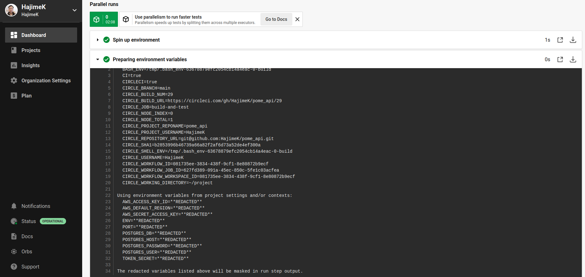

# My experience portofolio (pome as Proof Of My Experiences) Overview

## Overview

This is the central document for the design and implmentation of my experience portofolio (pome as Proof Of My Experiences) as a software programmer.

Below link navigates you to the frontend application page I have implemented.

http://pomefront.s3-website-ap-northeast-1.amazonaws.com/


### Development and Deployment Architecture

Folowing is the diagram showing the overview of the pipeline and infrastructure.


Implemented with
- Angular CLI: 14.2.6, Node: 16.18.0, Package Manager: npm 8.19.2 for the front end
- express.js: 4.17.1,  Node: 16.18.0, Package Manager: npm 8.19.2 for the front end for the backend API
- PostgreSQL 13.7 on AWS RDS for the backend DB
- [CircleCI](https://circleci.com/) for the CI/CD

For the detailed design and implemetation, please navigate to the links below.

## Front Web Application

### Software Design

https://github.com/HajimeK/pome_front/blob/main/architecture/overview.md


### package.json

https://github.com/HajimeK/pome_front/blob/main/package.json

|command|description|
|-|-|
|*npm install*| Install the dependent packages |
|*npm run build*| Build the applications to generate a distributable packages under dist folder|
|*npm run start*| Start the middleware |
### CI/CD with CircleCI

https://github.com/HajimeK/pome_front/blob/main/.circleci/config.yml


[](https://circleci.com/gh/HajimeK/pome_front)


For AWS deployment, some keys are configured for the aws commands to get permissions to upload to AWS environnment.
These are configured as environment variables in circleci as below.
```
  API_HOST
  AWS_ACCESS_KEY_ID
  AWS_DEFAULT_REGION
  AWS_SECRET_ACCESS_KEY
  PORT
```


In the output windown, those variables are masked as \*\*REDACTED\*\*

## Middleware API service

### Software Design

https://github.com/HajimeK/pome_api/blob/main/architecture/overview.md

|command|description|
|-|-|
|*npm install*| Install the dependent packages |
|*npm run build*| Build the applications to generate a distributable packages under dist folder|
|*npm run jasmine*| Automate the test |
|*npm run start*| Start the middleware |

### package.json

https://github.com/HajimeK/pome_api/blob/main/package.json

### CI/CD with CircleCI

[](https://circleci.com/gh/HajimeK/pome_api)
https://github.com/HajimeK/pome_api/blob/main/.circleci/config.yml


For AWS deployment, some keys are configured for the aws commands to get permissions to upload to AWS environnment.
These are configured as environment variables in circleci as below.
```
  AWS_ACCESS_KEY_ID
  AWS_DEFAULT_REGION
  AWS_SECRET_ACCESS_KEY
```

Middleware specifica environment variables are also set.
```
  ENV
  PORT
  POSTGRES_DB
  POSTGRES_HOST
  POSTGRES_PASSWORD
  POSTGRES_USER
  TOKEN_SECRET
```



In the output windown, those variables are masked as \*\*REDACTED\*\*


## Database Tables Design

https://github.com/HajimeK/pome_db/blob/main/architecture/overview.md
